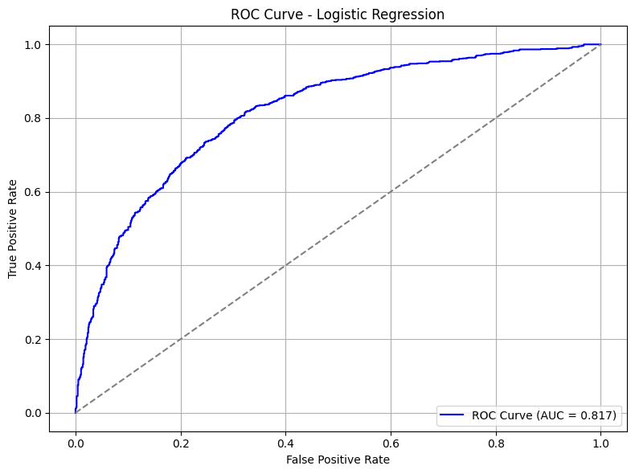
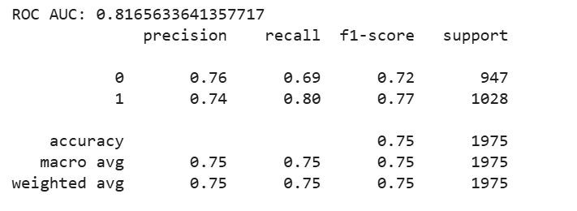

# heloc_credit_risk_scorecard

> **Suggested filename:** `heloc_credit_risk_scorecard.ipynb`  
> The name fully captures the dataset (HELOC), the problem (credit risk), and the approach (scorecard — WOE/IV + Logistic Regression).

---

## Credit Risk Modeling on HELOC Dataset

**Dataset:** FICO HELOC (Home Equity Line of Credit)  
**Task:** Binary classification — predict whether a customer is `Good` or `Bad` based on credit history  
**Method:** WOE/IV Feature Engineering + Logistic Regression Scorecard

---

## Pipeline Overview

$$
\text{Raw Data}
\xrightarrow{\text{EDA and Cleaning}}
\text{Processed Data}
\xrightarrow{\text{WOE/IV}}
\text{Selected Features}
\xrightarrow{\text{VIF}}
\text{Final Features}
\xrightarrow{\text{Logistic Regression}}
\text{Credit Scorecard}
$$

---

## Methodology

### 1. Exploratory Data Analysis

The raw dataset contains special sentinel values that represent missing information:

| Value | Meaning |
|-------|---------|
| $-9$ | Unknown |
| $-8$ | Not able to be computed |
| $-7$ | Not applicable |

These values are replaced with `NaN` before any further processing.

### 2. Data Processing

**Imputation:** Missing values are filled using the median:

$$\hat{x}_i = \text{median}(x_1, x_2, \ldots, x_n)$$

**Outlier Removal:** A two-step approach is applied sequentially:

Step 1 — IQR Filter:
$$\text{Keep: } Q_1 - 1.5 \cdot \text{IQR} \;\leq\; x_i \;\leq\; Q_3 + 1.5 \cdot \text{IQR}$$

Step 2 — Z-score Filter (applied on the IQR-filtered data):
$$\text{Keep: } |z_i| = \left|\frac{x_i - \mu}{\sigma}\right| < 3$$

### 3. Feature Engineering — WOE & IV

**Weight of Evidence (WOE)** for each bin $b$ of feature $X$:

$$\text{WOE}_b = \ln\!\left(\frac{P(\text{Good} \mid X \in b)}{P(\text{Bad} \mid X \in b)}\right) = \ln\!\left(\frac{n_{\text{good},b} / N_{\text{good}}}{n_{\text{bad},b} / N_{\text{bad}}}\right)$$

**Information Value (IV)** of feature $X$:

$$\text{IV}(X) = \sum_{b=1}^{B} \left(\frac{n_{\text{good},b}}{N_{\text{good}}} - \frac{n_{\text{bad},b}}{N_{\text{bad}}}\right) \times \text{WOE}_b$$

**Feature selection thresholds:**

| IV Range | Predictive Power |
|----------|-----------------|
| $< 0.02$ | Useless |
| $0.02 - 0.1$ | Weak |
| $0.1 - 0.3$ | Medium |
| $0.3 - 0.5$ | Strong |
| $> 0.5$ | Suspicious (possible overfitting) |

Only features with $\text{IV} > 0.1$ are retained.

### 4. Multicollinearity Check — VIF

**Variance Inflation Factor:**

$$\text{VIF}_j = \frac{1}{1 - R^2_j}$$

where $R^2_j$ is the coefficient of determination from regressing feature $X_j$ on all other features.

Features with $\text{VIF} > 5$ are removed due to multicollinearity.

### 5. Model — Logistic Regression

**Probability of Default:**

$$P(\text{Bad} \mid \mathbf{x}) = \sigma(\mathbf{w}^\top \mathbf{x} + b) = \frac{1}{1 + e^{-(\mathbf{w}^\top \mathbf{x} + b)}}$$

**Loss Function** (Binary Cross-Entropy):

$$\mathcal{L} = -\frac{1}{N}\sum_{i=1}^{N}\left[y_i \log \hat{p}_i + (1 - y_i)\log(1 - \hat{p}_i)\right]$$

**Train/Test split:** 80% / 20%, stratified by `target`.

---

## Evaluation

**Primary metric:** ROC-AUC

$$\text{AUC} = \int_0^1 \text{TPR}(t)\, d\,\text{FPR}(t)$$

Model performance is compared against a `DummyClassifier(strategy='most_frequent')` baseline.

### ROC Curve



*ROC curve of the Logistic Regression model versus the random baseline (gray diagonal). Higher AUC indicates better discrimination between Good and Bad customers.*

### Confusion Matrix



*Confusion matrix evaluated on the test set (20%). Rows represent actual labels; columns represent predicted labels.*

---

## Project Structure

```
heloc_credit_risk_scorecard/
├── heloc_credit_risk_scorecard.ipynb   # Main notebook
├── heloc_dataset_v1.csv                # Input dataset
├── images/
│   ├── roc_curve.png                   # ROC Curve plot
│   └── confusion_matrix.png            # Confusion Matrix plot
└── README.md
```

---

## Requirements

```
pandas
numpy
matplotlib
seaborn
scipy
scikit-learn
statsmodels
factor_analyzer
```

Install:
```bash
pip install pandas numpy matplotlib seaborn scipy scikit-learn statsmodels factor_analyzer
```

---

## References

- FICO HELOC Dataset: [Explainable Machine Learning Challenge](https://www.kaggle.com/datasets/averkiyoliabev/home-equity-line-of-creditheloc)
- Siddiqi, N. (2006). *Credit Risk Scorecards.* Wiley.
